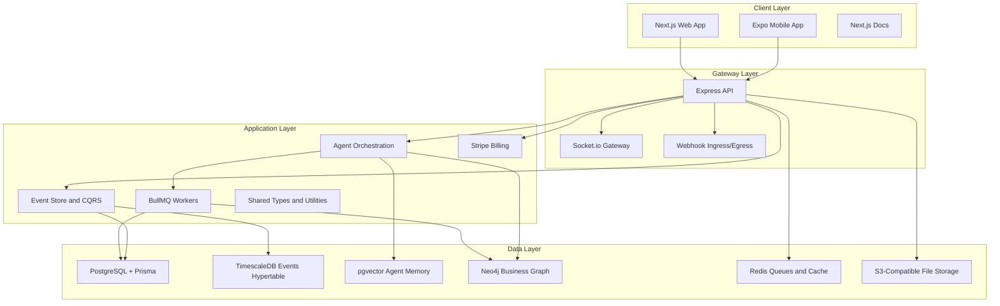
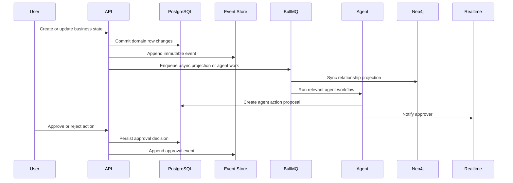

# Sentient Architecture

Sentient is an AI-Native Business Reality Engine. It models a business as a living operational graph, stores all important changes as events, and uses AI agents to observe state, recommend actions, and request human approval when needed.

Phase 0 establishes the modular monolith foundation. It keeps deployment simple while preserving package boundaries that can later become services.

## System Layers



## Monorepo Boundaries

```text
apps/
  web       Product UI
  mobile    Mobile approval and operational app
  docs      Developer and product documentation

packages/
  api       HTTP API boundary
  agents    AI agent definitions and orchestration contracts
  database  Prisma schema, migrations, seed, generated client
  events    Event sourcing and CQRS primitives
  graph     Neo4j schema and graph sync service
  queue     BullMQ queue contracts
  realtime  Socket.io realtime gateway contracts
  webhooks  Outbound webhook engine contracts
  billing   Stripe billing boundary
  shared    Shared types, constants, and utilities
```

## Architectural Style

Sentient starts as a modular monolith:

- One repository and one coordinated build graph.
- Clear package boundaries around data, graph, queue, realtime, billing, events, agents, and API.
- PostgreSQL remains the system of record.
- Neo4j, Redis, pgvector, and TimescaleDB are specialized projections or stores for specific query patterns.
- Agent actions use human approval workflows before execution unless explicitly configured otherwise.

This keeps Phase 0 practical while avoiding a tangled single package.

## Data Ownership

PostgreSQL owns durable business records:

- Organizations
- Users and sessions
- Workspaces
- Projects
- Tasks
- Agents and agent actions
- Event store
- Notifications
- Files
- Subscriptions
- Webhooks

TimescaleDB optimizes event time-series queries through the `events` hypertable.

pgvector stores agent memory embeddings in `agent_memory.embedding`.

Neo4j stores the query-optimized business graph:

- `Organization`
- `User`
- `Workspace`
- `Project`
- `Task`
- `Agent`

Redis supports cache, queue coordination, pub/sub, and BullMQ.

MinIO provides local S3-compatible object storage.

## Event And Agent Flow



## Phase 0 Infrastructure

Local development runs through Docker Compose:

- `postgres`: TimescaleDB-enabled PostgreSQL
- `redis`: Redis with append-only persistence
- `neo4j`: Neo4j 5 graph database
- `minio`: S3-compatible local object storage

CI/CD runs through GitHub Actions:

- `ci.yml`: lint, typecheck, tests
- `build.yml`: full monorepo build
- `deploy.yml`: deployment structure placeholder for staging and production

## Design Principles

- Keep PostgreSQL as the source of truth.
- Keep derived stores idempotently rebuildable.
- Use immutable events for auditability and future replay.
- Keep package boundaries explicit even before service extraction.
- Use human-in-the-loop approval for high-risk agent actions.
- Prefer typed contracts between packages over shared mutable state.
