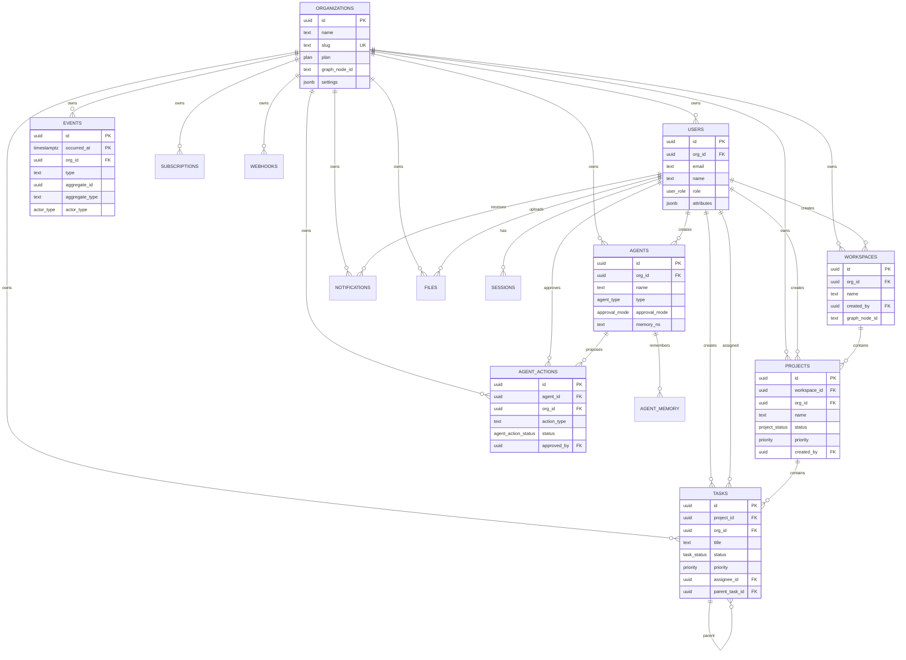

# Database Documentation

Sentient uses PostgreSQL as the source of truth, with TimescaleDB for event time-series storage, pgvector for agent memory embeddings, and Neo4j as a relationship projection.

The Prisma schema lives at:

```text
packages/database/prisma/schema.prisma
```

The initial SQL migration lives at:

```text
packages/database/prisma/migrations/000001_initial_schema/migration.sql
```

## PostgreSQL Extensions

The initial migration enables:

```sql
CREATE EXTENSION IF NOT EXISTS timescaledb;
CREATE EXTENSION IF NOT EXISTS vector;
CREATE EXTENSION IF NOT EXISTS pgcrypto;
```

`events` is converted into a TimescaleDB hypertable:

```sql
SELECT create_hypertable('events', 'occurred_at', if_not_exists => TRUE);
```

`agent_memory.embedding` uses pgvector:

```sql
CREATE INDEX IF NOT EXISTS agent_memory_embedding_idx
  ON agent_memory
  USING ivfflat (embedding vector_cosine_ops)
  WITH (lists = 100);
```

## Entity Relationship Diagram



## Core Tables

### organizations

Tenant root for all business data. Every major table carries `org_id` to keep tenant filtering direct and indexable.

Important fields:

- `slug`: unique organization slug.
- `plan`: subscription tier enum.
- `graph_node_id`: corresponding Neo4j node id.
- `settings`: JSON configuration for tenant-level preferences.

### users and sessions

Users belong to one organization and have RBAC roles. Sessions store refresh tokens and device metadata.

Important constraints:

- `users(org_id, email)` is unique.
- `sessions.refresh_token` is unique.
- Deleting a user cascades sessions.

### workspaces, projects, and tasks

Workspaces contain projects. Projects contain tasks. Tasks support:

- Optional assignee.
- Optional parent task for subtasks.
- Status, priority, due date, estimated hours, and kanban position.
- Denormalized `org_id` for efficient tenant queries.

### agents, agent_actions, and agent_memory

Agents represent AI workers such as Aria, Nova, Echo, and Flux. Agent actions are proposed or executed changes. Agent memory stores vector embeddings for semantic recall.

Important fields:

- `agents.memory_ns`: stable namespace for memory partitioning.
- `agents.approval_mode`: controls approval requirements.
- `agent_actions.status`: pending, approved, rejected, executed, or failed.
- `agent_memory.embedding`: `vector(1536)` for OpenAI embedding dimensions.

### events

The event store records immutable domain events. It uses a composite primary key:

```text
(id, occurred_at)
```

This is required because TimescaleDB hypertables require unique indexes and primary keys to include the partitioning column.

Query patterns:

- Tenant event feed: `org_id, occurred_at`
- Aggregate stream: `aggregate_type, aggregate_id, version`
- Event type timeline: `type, occurred_at`

### notifications

Notifications are user-scoped and organization-scoped. The key read model index is:

```text
(user_id, read, created_at)
```

### files

Files use a polymorphic target:

- `entity_type`
- `entity_id`

These are intentionally indexed but not foreign-key constrained, allowing files to attach to tasks, projects, workspaces, and future entity types.

### subscriptions and webhooks

Subscriptions track Stripe billing state and plan limits. Webhooks define outbound integration endpoints and subscribed event names.

## Enums

- `plan`: free, pro, business, enterprise
- `user_role`: super_admin, org_admin, manager, member, guest
- `project_status`: active, paused, archived, completed
- `task_status`: todo, in_progress, review, done, blocked
- `priority`: low, medium, high, critical
- `agent_type`: operations, finance, customer, dev, custom
- `approval_mode`: always, auto_low_risk, never
- `agent_action_status`: pending, approved, rejected, executed, failed
- `actor_type`: user, agent, system
- `subscription_status`: active, past_due, canceled, trialing

## Migration Workflow

Generate Prisma Client:

```bash
pnpm db:generate
```

Create or apply migrations during development:

```bash
pnpm db:migrate
```

Seed demo data:

```bash
pnpm db:seed
```

Open Prisma Studio:

```bash
pnpm --filter @sentient/database db:studio
```

## Neo4j Projection

Neo4j is not the source of truth. It is a projection optimized for relationship traversal.

Schema scripts:

```text
packages/graph/cypher/001_schema.cypher
packages/graph/cypher/002_seed_demo_graph.cypher
```

The graph projection is synchronized through `@sentient/graph` helpers after PostgreSQL writes commit. Future queue workers should consume events, load affected PostgreSQL rows, and update Neo4j idempotently.
