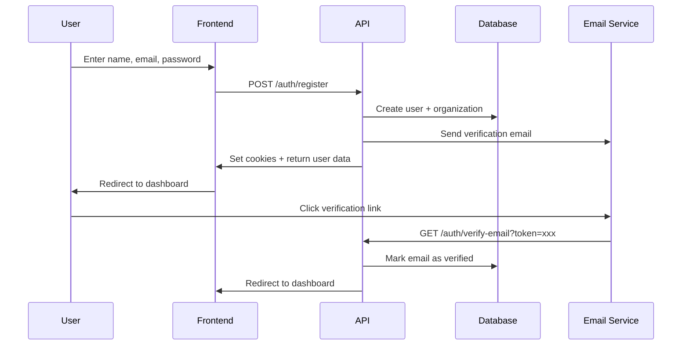
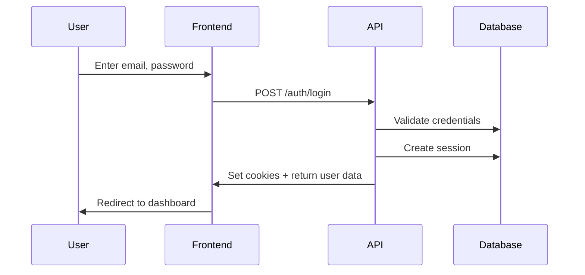
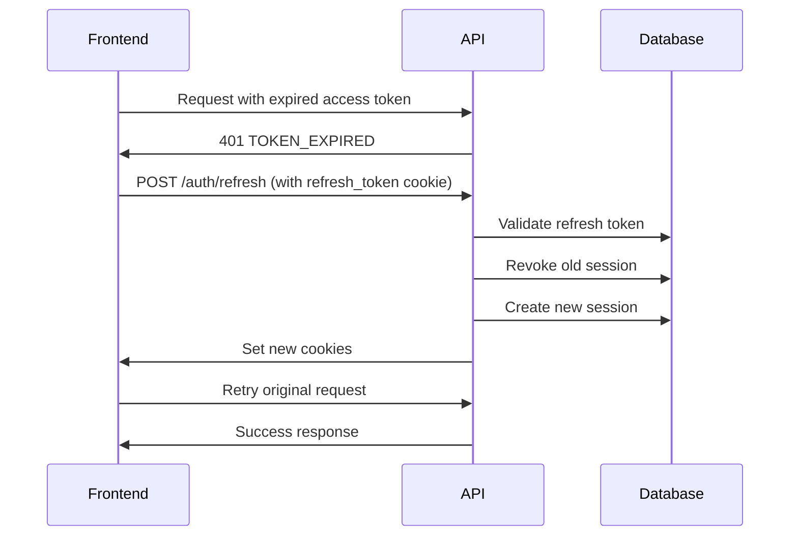

# Frontend API Integration Guide - Authentication System

## Table of Contents

1. [Overview](#overview)
2. [Quick Start](#quick-start)
3. [Authentication Flow](#authentication-flow)
4. [Cookie Handling](#cookie-handling)
5. [Token Refresh Implementation](#token-refresh-implementation)
6. [API Endpoints Reference](#api-endpoints-reference)
7. [Error Handling](#error-handling)
8. [Code Examples](#code-examples)
9. [Security Best Practices](#security-best-practices)
10. [Testing Guide](#testing-guide)

---

## Overview

The Sentient Authentication API provides secure user authentication using HTTP-only cookies and JWT tokens. This guide is specifically designed for frontend developers integrating with the authentication system.

### Key Features

- **Dual-token Architecture**: Short-lived access tokens (15 min) + long-lived refresh tokens (30 days)
- **Automatic Token Rotation**: Refresh tokens are rotated on every use for enhanced security
- **HTTP-only Cookies**: Tokens stored in secure cookies, not accessible via JavaScript
- **Multi-authentication Methods**: Email/password and Google OAuth 2.0
- **Email Verification**: Secure email confirmation flow
- **Password Reset**: Self-service password recovery
- **Multi-device Sessions**: View and manage active sessions across devices
- **Role-Based Access Control**: Five-tier permission system (super_admin, org_admin, manager, member, guest)

### Base URL

```
Production: https://api.sentient.com/v1/auth
Development: http://localhost:3000/v1/auth
```

All authentication endpoints are prefixed with `/v1/auth`.

---

## Quick Start

### 1. Basic Setup

All API requests must include credentials to send/receive cookies:

```javascript
// Using fetch
fetch('https://api.sentient.com/v1/auth/me', {
  credentials: 'include', // CRITICAL: Always include this
  headers: {
    'Content-Type': 'application/json',
  },
});

// Using axios
import axios from 'axios';

const api = axios.create({
  baseURL: 'https://api.sentient.com/v1',
  withCredentials: true, // CRITICAL: Always include this
});
```

### 2. Environment Variables

Configure these in your frontend environment:

```bash
VITE_API_BASE_URL=http://localhost:3000/v1
VITE_GOOGLE_CLIENT_ID=your-google-client-id
```

### 3. CORS Configuration

The backend is configured to accept requests from your frontend origin. Ensure your frontend URL is added to the backend's CORS whitelist.

**Allowed Origins** (configured on backend):
- `http://localhost:5173` (Vite dev server)
- `https://app.sentient.com` (production)

---

## Authentication Flow

### Registration Flow




### Login Flow



### Token Refresh Flow



---

## Cookie Handling

### Cookie Configuration

The API sets two HTTP-only cookies automatically:

| Cookie Name | Duration | Path | Purpose |
|-------------|----------|------|---------|
| `access_token` | 15 minutes | `/` | Authenticates API requests |
| `refresh_token` | 30 days | `/v1/auth` | Obtains new access tokens |

### Cookie Attributes

```
Set-Cookie: access_token=<jwt>; HttpOnly; Secure; SameSite=Lax; Max-Age=900; Path=/
Set-Cookie: refresh_token=<token>; HttpOnly; Secure; SameSite=Lax; Max-Age=2592000; Path=/v1/auth
```


**Attribute Explanations**:

- **HttpOnly**: Cookies are NOT accessible via JavaScript (`document.cookie`). This prevents XSS attacks from stealing tokens.
- **Secure**: Cookies are only sent over HTTPS in production (prevents man-in-the-middle attacks).
- **SameSite=Lax**: Provides CSRF protection while allowing normal navigation (e.g., clicking links from emails).
- **Path**: 
  - `access_token` is sent to all API routes (`/`)
  - `refresh_token` is only sent to auth endpoints (`/v1/auth`) to minimize exposure

### Important Notes for Frontend Developers

1. **DO NOT** try to read or store tokens in localStorage or sessionStorage
2. **DO NOT** try to access cookies via `document.cookie` (they're HttpOnly)
3. **DO** always include `credentials: 'include'` in fetch requests
4. **DO** always include `withCredentials: true` in axios requests
5. The browser automatically sends cookies with requests - you don't need to manually attach them

---

## Token Refresh Implementation

### Automatic Token Refresh

When an access token expires (after 15 minutes), the API returns a `401` error with code `TOKEN_EXPIRED`. Your frontend should automatically refresh the token and retry the request.

### Implementation with Fetch

```javascript
// api.js
const API_BASE_URL = import.meta.env.VITE_API_BASE_URL;

async function apiRequest(endpoint, options = {}) {
  const url = `${API_BASE_URL}${endpoint}`;
  
  let response = await fetch(url, {
    ...options,
    credentials: 'include',
    headers: {
      'Content-Type': 'application/json',
      ...options.headers,
    },
  });

  // Handle token expiration
  if (response.status === 401) {
    const errorData = await response.json();
    
    if (errorData.error?.code === 'TOKEN_EXPIRED') {
      // Attempt to refresh token
      const refreshResponse = await fetch(`${API_BASE_URL}/auth/refresh`, {
        method: 'POST',
        credentials: 'include',
      });

      if (refreshResponse.ok) {
        // Retry original request with new token
        response = await fetch(url, {
          ...options,
          credentials: 'include',
          headers: {
            'Content-Type': 'application/json',
            ...options.headers,
          },
        });
      } else {
        // Refresh failed - redirect to login
        window.location.href = '/login';
        throw new Error('Session expired. Please log in again.');
      }
    }
  }

  return response;
}

export { apiRequest };
```


### Implementation with Axios

```javascript
// api.js
import axios from 'axios';

const api = axios.create({
  baseURL: import.meta.env.VITE_API_BASE_URL,
  withCredentials: true,
  headers: {
    'Content-Type': 'application/json',
  },
});

// Response interceptor for automatic token refresh
api.interceptors.response.use(
  (response) => response,
  async (error) => {
    const originalRequest = error.config;

    // Check if error is due to expired token
    if (
      error.response?.status === 401 &&
      error.response?.data?.error?.code === 'TOKEN_EXPIRED' &&
      !originalRequest._retry
    ) {
      originalRequest._retry = true;

      try {
        // Attempt to refresh token
        await api.post('/auth/refresh');
        
        // Retry original request
        return api(originalRequest);
      } catch (refreshError) {
        // Refresh failed - redirect to login
        window.location.href = '/login';
        return Promise.reject(refreshError);
      }
    }

    return Promise.reject(error);
  }
);

export default api;
```

### Usage Example

```javascript
import api from './api';

// The interceptor handles token refresh automatically
async function fetchUserProfile() {
  try {
    const response = await api.get('/auth/me');
    return response.data;
  } catch (error) {
    console.error('Failed to fetch profile:', error);
    throw error;
  }
}
```

---

## API Endpoints Reference

### 1. Register

Create a new user account.

**Endpoint**: `POST /v1/auth/register`

**Rate Limit**: 5 requests per hour per IP

**Authentication**: None required

**Request Body**:
```json
{
  "name": "John Doe",
  "email": "john@example.com",
  "password": "SecurePass123!"
}
```

**Validation Rules**:
- `name`: 2-100 characters
- `email`: Valid email format (automatically lowercased)
- `password`: Minimum 8 characters with:
  - At least 1 uppercase letter
  - At least 1 number
  - At least 1 special character

**Success Response** (201):
```json
{
  "success": true,
  "data": {
    "user": {
      "id": "550e8400-e29b-41d4-a716-446655440000",
      "name": "John Doe",
      "email": "john@example.com",
      "role": "super_admin",
      "emailVerified": false,
      "avatarUrl": null
    },
    "org": {
      "id": "660e8400-e29b-41d4-a716-446655440000",
      "name": "John Doe's Organization",
      "slug": "john-does-organization",
      "plan": "free"
    }
  }
}
```


**Error Responses**:
- `409 Conflict`: Email already exists
- `422 Unprocessable Entity`: Validation failed
- `429 Too Many Requests`: Rate limit exceeded

**Side Effects**:
- Creates user account with hashed password
- Creates organization (if first user, assigns `super_admin` role; otherwise assigns `member` role)
- Generates email verification token and sends verification email
- Sets `access_token` and `refresh_token` cookies
- Creates session record in database

**Frontend Implementation**:
```javascript
async function register(name, email, password) {
  const response = await api.post('/auth/register', {
    name,
    email,
    password,
  });
  
  if (response.data.success) {
    // Cookies are automatically set by the browser
    // Redirect to dashboard
    window.location.href = '/dashboard';
  }
  
  return response.data;
}
```

---

### 2. Login

Authenticate with email and password.

**Endpoint**: `POST /v1/auth/login`

**Rate Limit**: 10 requests per 15 minutes per IP

**Authentication**: None required

**Request Body**:
```json
{
  "email": "john@example.com",
  "password": "SecurePass123!"
}
```

**Success Response** (200):
```json
{
  "success": true,
  "data": {
    "user": {
      "id": "550e8400-e29b-41d4-a716-446655440000",
      "name": "John Doe",
      "email": "john@example.com",
      "role": "super_admin",
      "emailVerified": true,
      "avatarUrl": "https://example.com/avatar.jpg"
    },
    "org": {
      "id": "660e8400-e29b-41d4-a716-446655440000",
      "name": "John Doe's Organization",
      "slug": "john-does-organization",
      "plan": "pro"
    }
  }
}
```

**Error Responses**:
- `401 Unauthorized`: Invalid credentials (generic message for security)
- `429 Too Many Requests`: Account locked (5 failed attempts) or rate limit exceeded

**Security Features**:
- Generic error message prevents email enumeration
- Account locks for 15 minutes after 5 failed attempts
- Failed attempt counter resets on successful login

**Frontend Implementation**:
```javascript
async function login(email, password) {
  try {
    const response = await api.post('/auth/login', {
      email,
      password,
    });
    
    if (response.data.success) {
      // Store user data in state/context
      setUser(response.data.data.user);
      setOrg(response.data.data.org);
      
      // Redirect to dashboard
      window.location.href = '/dashboard';
    }
    
    return response.data;
  } catch (error) {
    if (error.response?.data?.error?.code === 'ACCOUNT_LOCKED') {
      // Show account locked message with time remaining
      const lockedUntil = error.response.data.error.details?.lockedUntil;
      showError(`Account locked. Try again later.`);
    } else {
      showError('Invalid email or password');
    }
    throw error;
  }
}
```


---

### 3. Google OAuth Login

Authenticate using Google account.

**Initiation Endpoint**: `GET /v1/auth/google`

**Callback Endpoint**: `GET /v1/auth/google/callback`

**Authentication**: None required

**Flow**:
1. Redirect user to `/v1/auth/google`
2. User authenticates with Google
3. Google redirects to `/v1/auth/google/callback`
4. Backend sets cookies and redirects to dashboard

**Success**: Redirects to `FRONTEND_DASHBOARD_URL` with cookies set

**Error**: Redirects to `FRONTEND_LOGIN_URL?error=oauth_failed`

**Frontend Implementation**:
```javascript
function loginWithGoogle() {
  // Simply redirect to the Google OAuth endpoint
  window.location.href = `${API_BASE_URL}/auth/google`;
}

// In your login page component
function LoginPage() {
  const searchParams = new URLSearchParams(window.location.search);
  const error = searchParams.get('error');
  
  if (error === 'oauth_failed') {
    showError('Google authentication failed. Please try again.');
  }
  
  return (
    <button onClick={loginWithGoogle}>
      Sign in with Google
    </button>
  );
}
```

**Side Effects**:
- Creates user account if not exists
- Links Google account to existing user if email matches
- Sets `emailVerified` to `true` (Google emails are pre-verified)
- Sets cookies and creates session

---

### 4. Token Refresh

Obtain new access token using refresh token.

**Endpoint**: `POST /v1/auth/refresh`

**Rate Limit**: None (relies on token expiry)

**Authentication**: Requires `refresh_token` cookie

**Request Body**: None (reads cookie automatically)

**Success Response** (200):
```json
{
  "success": true
}
```

**Error Responses**:
- `401 Unauthorized`: Missing, invalid, expired, or revoked refresh token

**Side Effects**:
- Generates new access token (15 min expiry)
- Generates new refresh token (30 day expiry)
- Revokes old session
- Creates new session
- Sets new cookies

**Frontend Implementation**:
```javascript
async function refreshToken() {
  try {
    const response = await api.post('/auth/refresh');
    return response.data.success;
  } catch (error) {
    // Refresh failed - user needs to log in again
    window.location.href = '/login';
    return false;
  }
}
```

**Note**: This is typically handled automatically by the axios/fetch interceptor (see [Token Refresh Implementation](#token-refresh-implementation)).

---

### 5. Logout

End current session.

**Endpoint**: `POST /v1/auth/logout`

**Authentication**: Requires valid `access_token`

**Request Body**: None

**Success Response** (200):
```json
{
  "success": true
}
```

**Side Effects**:
- Revokes current session in database
- Clears both `access_token` and `refresh_token` cookies

**Frontend Implementation**:
```javascript
async function logout() {
  try {
    await api.post('/auth/logout');
    
    // Clear local state
    setUser(null);
    setOrg(null);
    
    // Redirect to login
    window.location.href = '/login';
  } catch (error) {
    console.error('Logout failed:', error);
    // Still redirect to login even if API call fails
    window.location.href = '/login';
  }
}
```


---

### 6. Logout All Devices

End all sessions across all devices.

**Endpoint**: `POST /v1/auth/logout-all`

**Authentication**: Requires valid `access_token`

**Request Body**: None

**Success Response** (200):
```json
{
  "success": true,
  "data": {
    "sessionsRevoked": 3
  }
}
```

**Side Effects**:
- Revokes ALL non-revoked sessions for the user
- Clears cookies on current device
- Other devices will be logged out on next request

**Frontend Implementation**:
```javascript
async function logoutAllDevices() {
  try {
    const response = await api.post('/auth/logout-all');
    
    alert(`Logged out from ${response.data.data.sessionsRevoked} devices`);
    
    // Clear local state and redirect
    setUser(null);
    setOrg(null);
    window.location.href = '/login';
  } catch (error) {
    console.error('Logout all failed:', error);
  }
}
```

---

### 7. Get Current User

Retrieve authenticated user information.

**Endpoint**: `GET /v1/auth/me`

**Authentication**: Requires valid `access_token`

**Request Body**: None

**Success Response** (200):
```json
{
  "success": true,
  "data": {
    "user": {
      "id": "550e8400-e29b-41d4-a716-446655440000",
      "name": "John Doe",
      "email": "john@example.com",
      "role": "super_admin",
      "emailVerified": true,
      "avatarUrl": "https://example.com/avatar.jpg"
    },
    "org": {
      "id": "660e8400-e29b-41d4-a716-446655440000",
      "name": "John Doe's Organization",
      "slug": "john-does-organization",
      "plan": "pro"
    }
  }
}
```

**Error Responses**:
- `401 Unauthorized`: Missing or invalid access token

**Frontend Implementation**:
```javascript
async function getCurrentUser() {
  try {
    const response = await api.get('/auth/me');
    return response.data.data;
  } catch (error) {
    if (error.response?.status === 401) {
      // Not authenticated - redirect to login
      window.location.href = '/login';
    }
    throw error;
  }
}

// Use in React component
function useAuth() {
  const [user, setUser] = useState(null);
  const [org, setOrg] = useState(null);
  const [loading, setLoading] = useState(true);

  useEffect(() => {
    async function loadUser() {
      try {
        const data = await getCurrentUser();
        setUser(data.user);
        setOrg(data.org);
      } catch (error) {
        console.error('Failed to load user:', error);
      } finally {
        setLoading(false);
      }
    }

    loadUser();
  }, []);

  return { user, org, loading };
}
```

---

### 8. Send Verification Email

Request a new email verification link.

**Endpoint**: `POST /v1/auth/send-verification`

**Rate Limit**: 3 requests per hour per user

**Authentication**: Requires valid `access_token`

**Request Body**: None

**Success Response** (200):
```json
{
  "success": true,
  "data": {
    "message": "Verification email sent"
  }
}
```

**Error Responses**:
- `400 Bad Request`: Email already verified
- `429 Too Many Requests`: Rate limit exceeded

**Frontend Implementation**:
```javascript
async function resendVerificationEmail() {
  try {
    const response = await api.post('/auth/send-verification');
    showSuccess('Verification email sent! Check your inbox.');
    return response.data;
  } catch (error) {
    if (error.response?.data?.error?.code === 'EMAIL_ALREADY_VERIFIED') {
      showInfo('Your email is already verified');
    } else {
      showError('Failed to send verification email');
    }
    throw error;
  }
}
```


---

### 9. Verify Email

Verify email address using token from email.

**Endpoint**: `GET /v1/auth/verify-email`

**Authentication**: None required

**Query Parameters**:
- `token` (required): Verification token from email link

**Success Response** (200):
```json
{
  "success": true,
  "data": {
    "message": "Email verified successfully"
  }
}
```

**Error Responses**:
- `400 Bad Request`: Invalid or expired token

**Frontend Implementation**:
```javascript
// In your email verification page component
function EmailVerificationPage() {
  const [status, setStatus] = useState('verifying');
  const searchParams = new URLSearchParams(window.location.search);
  const token = searchParams.get('token');

  useEffect(() => {
    async function verifyEmail() {
      if (!token) {
        setStatus('error');
        return;
      }

      try {
        await api.get(`/auth/verify-email?token=${token}`);
        setStatus('success');
        
        // Redirect to dashboard after 2 seconds
        setTimeout(() => {
          window.location.href = '/dashboard';
        }, 2000);
      } catch (error) {
        setStatus('error');
      }
    }

    verifyEmail();
  }, [token]);

  if (status === 'verifying') {
    return <div>Verifying your email...</div>;
  }

  if (status === 'success') {
    return <div>Email verified! Redirecting to dashboard...</div>;
  }

  return (
    <div>
      <p>Verification failed. The link may be expired.</p>
      <button onClick={resendVerificationEmail}>
        Send new verification email
      </button>
    </div>
  );
}
```

---

### 10. Forgot Password

Request password reset email.

**Endpoint**: `POST /v1/auth/forgot-password`

**Rate Limit**: 3 requests per hour per IP

**Authentication**: None required

**Request Body**:
```json
{
  "email": "john@example.com"
}
```

**Success Response** (200):
```json
{
  "success": true,
  "data": {
    "message": "If that email exists, a reset link was sent"
  }
}
```

**Security**: Returns same success message whether email exists or not (prevents email enumeration).

**Frontend Implementation**:
```javascript
async function forgotPassword(email) {
  try {
    const response = await api.post('/auth/forgot-password', { email });
    
    showSuccess(
      'If that email is registered, you will receive a password reset link shortly.'
    );
    
    return response.data;
  } catch (error) {
    if (error.response?.status === 429) {
      showError('Too many requests. Please try again later.');
    } else {
      showError('Failed to send reset email');
    }
    throw error;
  }
}
```

---

### 11. Reset Password

Reset password using token from email.

**Endpoint**: `POST /v1/auth/reset-password`

**Authentication**: None required

**Request Body**:
```json
{
  "token": "abc123...",
  "password": "NewSecurePass123!"
}
```

**Validation Rules**:
- `password`: Same rules as registration (min 8 chars, 1 uppercase, 1 number, 1 special char)

**Success Response** (200):
```json
{
  "success": true,
  "data": {
    "message": "Password reset successfully. Please log in."
  }
}
```

**Error Responses**:
- `400 Bad Request`: Invalid or expired token
- `422 Unprocessable Entity`: Password validation failed

**Side Effects**:
- Updates password hash
- **Revokes ALL active sessions** (security measure)
- Clears reset token

**Frontend Implementation**:
```javascript
function ResetPasswordPage() {
  const [password, setPassword] = useState('');
  const [confirmPassword, setConfirmPassword] = useState('');
  const searchParams = new URLSearchParams(window.location.search);
  const token = searchParams.get('token');

  async function handleSubmit(e) {
    e.preventDefault();

    if (password !== confirmPassword) {
      showError('Passwords do not match');
      return;
    }

    try {
      await api.post('/auth/reset-password', {
        token,
        password,
      });

      showSuccess('Password reset successfully!');
      
      // Redirect to login
      setTimeout(() => {
        window.location.href = '/login';
      }, 2000);
    } catch (error) {
      if (error.response?.data?.error?.code === 'INVALID_TOKEN') {
        showError('Reset link is invalid or expired');
      } else {
        showError('Failed to reset password');
      }
    }
  }

  return (
    <form onSubmit={handleSubmit}>
      <input
        type="password"
        value={password}
        onChange={(e) => setPassword(e.target.value)}
        placeholder="New password"
        required
      />
      <input
        type="password"
        value={confirmPassword}
        onChange={(e) => setConfirmPassword(e.target.value)}
        placeholder="Confirm password"
        required
      />
      <button type="submit">Reset Password</button>
    </form>
  );
}
```


---

### 12. List Active Sessions

View all active sessions across devices.

**Endpoint**: `GET /v1/auth/sessions`

**Authentication**: Requires valid `access_token`

**Request Body**: None

**Success Response** (200):
```json
{
  "success": true,
  "data": {
    "sessions": [
      {
        "id": "session-uuid-1",
        "deviceInfo": {
          "userAgent": "Mozilla/5.0...",
          "ip": "192.168.1.1",
          "browser": "Chrome",
          "os": "macOS"
        },
        "createdAt": "2026-05-15T10:30:00Z",
        "expiresAt": "2026-06-14T10:30:00Z",
        "isCurrent": true
      },
      {
        "id": "session-uuid-2",
        "deviceInfo": {
          "userAgent": "Mozilla/5.0...",
          "ip": "192.168.1.5",
          "browser": "Safari",
          "os": "iOS"
        },
        "createdAt": "2026-05-10T08:15:00Z",
        "expiresAt": "2026-06-09T08:15:00Z",
        "isCurrent": false
      }
    ]
  }
}
```

**Frontend Implementation**:
```javascript
async function getActiveSessions() {
  const response = await api.get('/auth/sessions');
  return response.data.data.sessions;
}

function SessionsPage() {
  const [sessions, setSessions] = useState([]);

  useEffect(() => {
    async function loadSessions() {
      const data = await getActiveSessions();
      setSessions(data);
    }
    loadSessions();
  }, []);

  return (
    <div>
      <h2>Active Sessions</h2>
      {sessions.map((session) => (
        <div key={session.id} className={session.isCurrent ? 'current' : ''}>
          <p>
            {session.deviceInfo.browser} on {session.deviceInfo.os}
            {session.isCurrent && ' (Current)'}
          </p>
          <p>IP: {session.deviceInfo.ip}</p>
          <p>Created: {new Date(session.createdAt).toLocaleString()}</p>
          {!session.isCurrent && (
            <button onClick={() => revokeSession(session.id)}>
              Revoke
            </button>
          )}
        </div>
      ))}
    </div>
  );
}
```

---

### 13. Revoke Specific Session

Revoke a specific session (logout a device).

**Endpoint**: `DELETE /v1/auth/sessions/:sessionId`

**Authentication**: Requires valid `access_token`

**URL Parameters**:
- `sessionId`: UUID of the session to revoke

**Success Response** (200):
```json
{
  "success": true
}
```

**Error Responses**:
- `403 Forbidden`: Session does not belong to authenticated user
- `404 Not Found`: Session not found

**Frontend Implementation**:
```javascript
async function revokeSession(sessionId) {
  try {
    await api.delete(`/auth/sessions/${sessionId}`);
    
    showSuccess('Session revoked successfully');
    
    // Refresh sessions list
    const updatedSessions = await getActiveSessions();
    setSessions(updatedSessions);
  } catch (error) {
    if (error.response?.status === 403) {
      showError('You cannot revoke this session');
    } else {
      showError('Failed to revoke session');
    }
  }
}
```

---

## Error Handling

### Error Response Structure

All errors follow this format:

```json
{
  "success": false,
  "error": {
    "code": "ERROR_CODE",
    "message": "Human-readable error message",
    "details": {
      // Optional additional context
    }
  }
}
```

### Complete Error Code Reference

| HTTP Status | Error Code | Description | Frontend Action |
|-------------|------------|-------------|-----------------|
| 400 | `VALIDATION_ERROR` | Request validation failed | Show validation errors to user |
| 400 | `INVALID_TOKEN` | Token is invalid or expired | Show error, allow retry |
| 400 | `EMAIL_ALREADY_VERIFIED` | Email is already verified | Show info message |
| 401 | `UNAUTHORIZED` | Missing or invalid authentication | Redirect to login |
| 401 | `INVALID_CREDENTIALS` | Wrong email or password | Show generic error message |
| 401 | `TOKEN_EXPIRED` | Access token has expired | Trigger automatic token refresh |
| 403 | `FORBIDDEN` | Insufficient permissions | Show "Access denied" message |
| 403 | `RESOURCE_ACCESS_DENIED` | Cannot access this resource | Show "Access denied" message |
| 409 | `EMAIL_EXISTS` | Email already registered | Show "Email already in use" |
| 429 | `RATE_LIMITED` | Too many requests | Show retry message with time |
| 429 | `ACCOUNT_LOCKED` | Account locked due to failed attempts | Show locked message with time |
| 500 | `INTERNAL_ERROR` | Unexpected server error | Show generic error, log details |


### Global Error Handler

```javascript
// errorHandler.js
export function handleApiError(error) {
  if (!error.response) {
    // Network error
    showError('Network error. Please check your connection.');
    return;
  }

  const { status, data } = error.response;
  const errorCode = data?.error?.code;
  const errorMessage = data?.error?.message;

  switch (status) {
    case 400:
      if (errorCode === 'VALIDATION_ERROR') {
        // Show field-specific errors
        const details = data.error.details;
        Object.keys(details).forEach((field) => {
          showFieldError(field, details[field].join(', '));
        });
      } else {
        showError(errorMessage || 'Invalid request');
      }
      break;

    case 401:
      if (errorCode === 'TOKEN_EXPIRED') {
        // Handled by interceptor
        return;
      }
      // Redirect to login for other 401 errors
      window.location.href = '/login';
      break;

    case 403:
      showError('You do not have permission to perform this action');
      break;

    case 409:
      showError(errorMessage || 'Conflict error');
      break;

    case 429:
      if (errorCode === 'ACCOUNT_LOCKED') {
        const lockedUntil = data.error.details?.lockedUntil;
        showError(
          `Account locked due to too many failed attempts. Try again later.`
        );
      } else {
        const retryAfter = data.error.details?.retryAfter;
        showError(
          `Too many requests. Please try again in ${Math.ceil(retryAfter / 60)} minutes.`
        );
      }
      break;

    case 500:
      showError('An unexpected error occurred. Please try again later.');
      console.error('Server error:', data);
      break;

    default:
      showError(errorMessage || 'An error occurred');
  }
}
```

---

## Code Examples

### Complete Authentication Context (React)

```javascript
// contexts/AuthContext.jsx
import { createContext, useContext, useState, useEffect } from 'react';
import api from '../api';

const AuthContext = createContext(null);

export function AuthProvider({ children }) {
  const [user, setUser] = useState(null);
  const [org, setOrg] = useState(null);
  const [loading, setLoading] = useState(true);

  useEffect(() => {
    loadUser();
  }, []);

  async function loadUser() {
    try {
      const response = await api.get('/auth/me');
      setUser(response.data.data.user);
      setOrg(response.data.data.org);
    } catch (error) {
      // User not authenticated
      setUser(null);
      setOrg(null);
    } finally {
      setLoading(false);
    }
  }

  async function register(name, email, password) {
    const response = await api.post('/auth/register', {
      name,
      email,
      password,
    });
    
    setUser(response.data.data.user);
    setOrg(response.data.data.org);
    
    return response.data;
  }

  async function login(email, password) {
    const response = await api.post('/auth/login', {
      email,
      password,
    });
    
    setUser(response.data.data.user);
    setOrg(response.data.data.org);
    
    return response.data;
  }

  async function logout() {
    await api.post('/auth/logout');
    setUser(null);
    setOrg(null);
  }

  const value = {
    user,
    org,
    loading,
    register,
    login,
    logout,
    isAuthenticated: !!user,
  };

  return <AuthContext.Provider value={value}>{children}</AuthContext.Provider>;
}

export function useAuth() {
  const context = useContext(AuthContext);
  if (!context) {
    throw new Error('useAuth must be used within AuthProvider');
  }
  return context;
}
```

### Protected Route Component

```javascript
// components/ProtectedRoute.jsx
import { Navigate } from 'react-router-dom';
import { useAuth } from '../contexts/AuthContext';

export function ProtectedRoute({ children, requiredRole }) {
  const { user, loading } = useAuth();

  if (loading) {
    return <div>Loading...</div>;
  }

  if (!user) {
    return <Navigate to="/login" replace />;
  }

  // Check role if required
  if (requiredRole) {
    const roleHierarchy = ['guest', 'member', 'manager', 'org_admin', 'super_admin'];
    const userRoleIndex = roleHierarchy.indexOf(user.role);
    const requiredRoleIndex = roleHierarchy.indexOf(requiredRole);

    if (userRoleIndex < requiredRoleIndex) {
      return <Navigate to="/unauthorized" replace />;
    }
  }

  return children;
}

// Usage
<Route
  path="/admin"
  element={
    <ProtectedRoute requiredRole="org_admin">
      <AdminDashboard />
    </ProtectedRoute>
  }
/>
```


### Login Form Component

```javascript
// components/LoginForm.jsx
import { useState } from 'react';
import { useAuth } from '../contexts/AuthContext';
import { useNavigate } from 'react-router-dom';
import { handleApiError } from '../utils/errorHandler';

export function LoginForm() {
  const [email, setEmail] = useState('');
  const [password, setPassword] = useState('');
  const [loading, setLoading] = useState(false);
  const { login } = useAuth();
  const navigate = useNavigate();

  async function handleSubmit(e) {
    e.preventDefault();
    setLoading(true);

    try {
      await login(email, password);
      navigate('/dashboard');
    } catch (error) {
      handleApiError(error);
    } finally {
      setLoading(false);
    }
  }

  function handleGoogleLogin() {
    window.location.href = `${import.meta.env.VITE_API_BASE_URL}/auth/google`;
  }

  return (
    <form onSubmit={handleSubmit}>
      <input
        type="email"
        value={email}
        onChange={(e) => setEmail(e.target.value)}
        placeholder="Email"
        required
      />
      <input
        type="password"
        value={password}
        onChange={(e) => setPassword(e.target.value)}
        placeholder="Password"
        required
      />
      <button type="submit" disabled={loading}>
        {loading ? 'Logging in...' : 'Log In'}
      </button>
      
      <div className="divider">OR</div>
      
      <button type="button" onClick={handleGoogleLogin}>
        Sign in with Google
      </button>
      
      <a href="/forgot-password">Forgot password?</a>
    </form>
  );
}
```

### Registration Form Component

```javascript
// components/RegisterForm.jsx
import { useState } from 'react';
import { useAuth } from '../contexts/AuthContext';
import { useNavigate } from 'react-router-dom';
import { handleApiError } from '../utils/errorHandler';

export function RegisterForm() {
  const [formData, setFormData] = useState({
    name: '',
    email: '',
    password: '',
    confirmPassword: '',
  });
  const [loading, setLoading] = useState(false);
  const { register } = useAuth();
  const navigate = useNavigate();

  function handleChange(e) {
    setFormData({
      ...formData,
      [e.target.name]: e.target.value,
    });
  }

  async function handleSubmit(e) {
    e.preventDefault();

    if (formData.password !== formData.confirmPassword) {
      showError('Passwords do not match');
      return;
    }

    setLoading(true);

    try {
      await register(formData.name, formData.email, formData.password);
      navigate('/dashboard');
      showSuccess('Account created! Please check your email to verify your account.');
    } catch (error) {
      handleApiError(error);
    } finally {
      setLoading(false);
    }
  }

  return (
    <form onSubmit={handleSubmit}>
      <input
        type="text"
        name="name"
        value={formData.name}
        onChange={handleChange}
        placeholder="Full Name"
        required
        minLength={2}
        maxLength={100}
      />
      <input
        type="email"
        name="email"
        value={formData.email}
        onChange={handleChange}
        placeholder="Email"
        required
      />
      <input
        type="password"
        name="password"
        value={formData.password}
        onChange={handleChange}
        placeholder="Password"
        required
        minLength={8}
      />
      <input
        type="password"
        name="confirmPassword"
        value={formData.confirmPassword}
        onChange={handleChange}
        placeholder="Confirm Password"
        required
      />
      <p className="password-requirements">
        Password must be at least 8 characters with 1 uppercase letter, 1 number, and 1 special character
      </p>
      <button type="submit" disabled={loading}>
        {loading ? 'Creating account...' : 'Sign Up'}
      </button>
    </form>
  );
}
```

---

## Security Best Practices

### 1. Always Use HTTPS in Production

Ensure your production frontend is served over HTTPS. The `secure` cookie flag ensures cookies are only sent over HTTPS.

### 2. Never Store Tokens in localStorage

The API uses HTTP-only cookies specifically to prevent XSS attacks. Never attempt to:
- Read tokens from cookies via JavaScript
- Store tokens in localStorage or sessionStorage
- Manually attach tokens to requests

### 3. Always Include Credentials

Every API request must include `credentials: 'include'` (fetch) or `withCredentials: true` (axios) to send cookies.

### 4. Handle Token Expiration Gracefully

Implement automatic token refresh using interceptors (see [Token Refresh Implementation](#token-refresh-implementation)).

### 5. Validate User Input

Always validate user input on the frontend before sending to the API:
- Email format validation
- Password strength requirements
- Name length constraints

### 6. Use Generic Error Messages

For security-sensitive operations (login, password reset), use generic error messages that don't reveal whether an email exists.

### 7. Implement CSRF Protection

The API uses `SameSite=Lax` cookies for CSRF protection. Ensure your frontend:
- Makes requests from the same origin
- Doesn't use `SameSite=None` unless absolutely necessary

### 8. Clear Sensitive Data on Logout

When logging out, clear all user data from state/context to prevent data leakage.

### 9. Implement Rate Limiting Feedback

Show appropriate messages when rate limits are hit, including time remaining.

### 10. Use Environment Variables

Never hardcode API URLs or client IDs. Use environment variables:

```bash
# .env.development
VITE_API_BASE_URL=http://localhost:3000/v1
VITE_GOOGLE_CLIENT_ID=your-dev-client-id

# .env.production
VITE_API_BASE_URL=https://api.sentient.com/v1
VITE_GOOGLE_CLIENT_ID=your-prod-client-id
```


---

## Testing Guide

### Testing Authentication Flows

#### 1. Manual Testing Checklist

**Registration Flow**:
- [ ] Register with valid credentials
- [ ] Verify cookies are set in browser DevTools
- [ ] Check verification email is received
- [ ] Click verification link and confirm email is verified
- [ ] Try registering with same email (should fail with 409)
- [ ] Try weak password (should fail validation)
- [ ] Test rate limiting (5 requests per hour)

**Login Flow**:
- [ ] Login with correct credentials
- [ ] Verify cookies are set
- [ ] Try login with wrong password (should fail with generic error)
- [ ] Try 5 failed logins to trigger account lock
- [ ] Verify account lock message shows time remaining
- [ ] Wait for lock to expire and login successfully

**Token Refresh Flow**:
- [ ] Make authenticated request
- [ ] Wait 15 minutes for token to expire
- [ ] Make another request (should auto-refresh)
- [ ] Verify new cookies are set
- [ ] Confirm request succeeds after refresh

**Logout Flow**:
- [ ] Logout and verify cookies are cleared
- [ ] Try accessing protected route (should redirect to login)
- [ ] Login on multiple devices
- [ ] Use "Logout All" and verify all sessions are revoked

**Password Reset Flow**:
- [ ] Request password reset
- [ ] Check reset email is received
- [ ] Click reset link
- [ ] Set new password
- [ ] Verify all sessions are revoked
- [ ] Login with new password

**Google OAuth Flow**:
- [ ] Click "Sign in with Google"
- [ ] Complete Google authentication
- [ ] Verify redirect to dashboard with cookies set
- [ ] Check email is marked as verified

#### 2. Automated Testing with Playwright

```javascript
// tests/auth.spec.js
import { test, expect } from '@playwright/test';

test.describe('Authentication', () => {
  test('should register new user', async ({ page }) => {
    await page.goto('/register');
    
    await page.fill('input[name="name"]', 'Test User');
    await page.fill('input[name="email"]', 'test@example.com');
    await page.fill('input[name="password"]', 'SecurePass123!');
    await page.fill('input[name="confirmPassword"]', 'SecurePass123!');
    
    await page.click('button[type="submit"]');
    
    // Should redirect to dashboard
    await expect(page).toHaveURL('/dashboard');
    
    // Should show success message
    await expect(page.locator('.success-message')).toContainText(
      'Please check your email'
    );
  });

  test('should login existing user', async ({ page }) => {
    await page.goto('/login');
    
    await page.fill('input[type="email"]', 'test@example.com');
    await page.fill('input[type="password"]', 'SecurePass123!');
    
    await page.click('button[type="submit"]');
    
    await expect(page).toHaveURL('/dashboard');
  });

  test('should handle invalid credentials', async ({ page }) => {
    await page.goto('/login');
    
    await page.fill('input[type="email"]', 'test@example.com');
    await page.fill('input[type="password"]', 'WrongPassword');
    
    await page.click('button[type="submit"]');
    
    await expect(page.locator('.error-message')).toContainText(
      'Invalid email or password'
    );
  });

  test('should logout user', async ({ page, context }) => {
    // Login first
    await page.goto('/login');
    await page.fill('input[type="email"]', 'test@example.com');
    await page.fill('input[type="password"]', 'SecurePass123!');
    await page.click('button[type="submit"]');
    await expect(page).toHaveURL('/dashboard');
    
    // Logout
    await page.click('button:has-text("Logout")');
    
    // Should redirect to login
    await expect(page).toHaveURL('/login');
    
    // Cookies should be cleared
    const cookies = await context.cookies();
    const authCookies = cookies.filter(
      (c) => c.name === 'access_token' || c.name === 'refresh_token'
    );
    expect(authCookies).toHaveLength(0);
  });
});
```

#### 3. Testing API Integration

```javascript
// tests/api.test.js
import { describe, it, expect, beforeEach } from 'vitest';
import api from '../src/api';

describe('Auth API', () => {
  let testUser = {
    name: 'Test User',
    email: `test-${Date.now()}@example.com`,
    password: 'SecurePass123!',
  };

  it('should register new user', async () => {
    const response = await api.post('/auth/register', testUser);
    
    expect(response.status).toBe(201);
    expect(response.data.success).toBe(true);
    expect(response.data.data.user.email).toBe(testUser.email);
    expect(response.data.data.user.emailVerified).toBe(false);
  });

  it('should login user', async () => {
    const response = await api.post('/auth/login', {
      email: testUser.email,
      password: testUser.password,
    });
    
    expect(response.status).toBe(200);
    expect(response.data.success).toBe(true);
    expect(response.data.data.user.email).toBe(testUser.email);
  });

  it('should get current user', async () => {
    // Login first
    await api.post('/auth/login', {
      email: testUser.email,
      password: testUser.password,
    });
    
    const response = await api.get('/auth/me');
    
    expect(response.status).toBe(200);
    expect(response.data.data.user.email).toBe(testUser.email);
  });

  it('should refresh token', async () => {
    // Login first
    await api.post('/auth/login', {
      email: testUser.email,
      password: testUser.password,
    });
    
    const response = await api.post('/auth/refresh');
    
    expect(response.status).toBe(200);
    expect(response.data.success).toBe(true);
  });

  it('should logout user', async () => {
    // Login first
    await api.post('/auth/login', {
      email: testUser.email,
      password: testUser.password,
    });
    
    const response = await api.post('/auth/logout');
    
    expect(response.status).toBe(200);
    expect(response.data.success).toBe(true);
    
    // Subsequent requests should fail
    await expect(api.get('/auth/me')).rejects.toThrow();
  });
});
```

---

## Troubleshooting

### Common Issues

#### 1. Cookies Not Being Set

**Symptoms**: Login succeeds but subsequent requests return 401

**Solutions**:
- Ensure `credentials: 'include'` is set on all requests
- Check CORS configuration allows credentials
- Verify frontend and backend are on same domain or CORS is properly configured
- Check browser console for cookie warnings

#### 2. Token Refresh Not Working

**Symptoms**: User gets logged out after 15 minutes

**Solutions**:
- Verify axios/fetch interceptor is properly configured
- Check that `TOKEN_EXPIRED` error code is being handled
- Ensure refresh endpoint is being called with credentials
- Check browser DevTools Network tab for refresh request

#### 3. CORS Errors

**Symptoms**: Requests fail with CORS policy errors

**Solutions**:
- Verify frontend origin is in backend CORS whitelist
- Ensure `withCredentials: true` is set
- Check backend CORS configuration allows credentials
- Verify preflight OPTIONS requests are succeeding

#### 4. Rate Limiting Issues

**Symptoms**: Getting 429 errors during development

**Solutions**:
- Use different IP addresses or wait for rate limit to reset
- Ask backend team to increase rate limits for development
- Clear Redis cache if testing locally

#### 5. Google OAuth Not Working

**Symptoms**: OAuth flow fails or redirects to error page

**Solutions**:
- Verify Google Client ID is correct
- Check redirect URI is registered in Google Console
- Ensure callback URL matches backend configuration
- Check browser console for errors

---

## Additional Resources

### API Postman Collection

A Postman collection with all authentication endpoints is available at:
```
/postman/collections/authentication.json
```

Import this into Postman for easy API testing.

### Backend Documentation

For backend implementation details, see:
- `/docs/API_AUTHENTICATION.md` - Complete API reference
- `/docs/ARCHITECTURE.md` - System architecture
- `/docs/DATABASE.md` - Database schema

### Support

For questions or issues:
1. Check this documentation first
2. Review backend API documentation
3. Contact the backend team
4. Create an issue in the project repository

---

## Changelog

### Version 1.0.0 (2026-05-15)
- Initial documentation release
- Complete API endpoint reference
- Token refresh implementation guide
- Code examples for React
- Security best practices
- Testing guide

---

**Last Updated**: May 15, 2026  
**Maintained By**: Backend Team  
**Frontend Contact**: [Your Team Lead]
